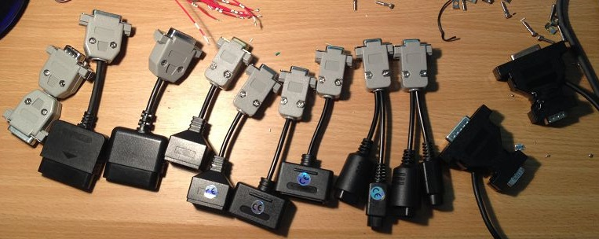

# RetroAdapterMod
Mod of Paul Qureshi's Mojo RetroAdapter Firmware by rsn8887

Firmware v2.1a Mod v1.4

----------


Retro Adapter Mod is a firmware mod for Paul Qureshi's Mojo Retro Adapter based on original Atmega168 code by Paul Qureshi and Bruno Freitas.

With the adapter one can connect old controllers to PC. This firmware mod adds support for using your old controllers on the Xbox classic and Android host systems, as well as support for the NegCon controller.

The bin archive just includes the .hex files needed to update the firmware.
The src archive includes all sources, binaries, and the original code this mod is based on.

See included readme.txt for more info.

References
----------

License GPL (see License.txt)

- Original source for "USB Retropad Adapter" from Bruno Freitas acquired via
http://www.brunofreitas.com/node/41
(included for reference in folder original_Files)

- Original source for "Retro Adapter v2.1a" from Paul Qureshi acquired via
http://denki.world3.net/retro_v2.html
(incuded for reference in folder original_Files)

- This mod by rsn8887 [](https://www.paypal.com/cgi-bin/webscr?cmd=_donations&business=72LHAQPSSKDGE&lc=US&item_name=RetroAdapter%20Firmware%20MOD%20Donation&currency_code=USD&bn=PP%2dDonationsBF%3abtn_donateCC_LG%2egif%3aNonHosted "Donate once-off to this project using Paypal")

What is it?
-----------

- Included are four modified versions of the original Mojo Retroadapter firmware, as hex and source files. There's a version for Xbox, one for arcade cabinets, one for PC and Android, and one for Switch

- All four versions include the NegCon controller support.

- Xbox mode:
 - A RetroAdapter updated with this version of the modded Firmware only works on Xbox Classic (note: you can always go back after modding using the adapter's USB update feature)
 - I used the Xbox communication and initialization code from Bruno Freitas' Retropad Adapter and merged it into the codebase from Paul Qureshi
 - See http://www.brunofreitas.com/node/41 for more information on Bruno Freitas' adapter
 - SNES mouse and dual player support was removed to comply with the limitations of the XBox classic
 - For 2-4 player support, just hook up multiple retroadapters to the Xbox, one player per port

- Switch mode:
 - This is for use on Nintendo Switch. Note the Switch can support up to three simultaneous wired adapters running this version of the firmware (using a USB hub).

- Normal mode:
 - This is for use on PC and Android. In Android, the original RetroAdapter was not reporting directions up and left for NES and some other controller types.

- Arcade mode:
 - This version is suited for use in an arcade cabinet. It works on PCs just like the original RetroAdapter, but I replaced Neogeo stick support on the DB15 with an arcade mode that has just 8 firebuttons on the DB15, to give you a total of 10 buttons and 4 directions when you hook up your Arcade controls to pins on both DB9 and DB15.

- Button config:

Windows Host (Andr.) | XBox Host | Switch Host | Description    | SNES   | PSX     | NegCon | NES    | NeoGeo | Genesis | Gamecube | N64       | PCE    | Saturn
-------------------- | --------- | ----------- | -------------- | ------ | ------- | ------ | ------ | ------ | ------- | -------- | --------- | ------ | ------  
Button 1 (A)         | A         | B           | Bottom button  | B      | Cross   | I      | B      | A      | A       | A        | B         | II     | A
Button 2 (B)         | B         | A           | Right button   | A      | Circle  | A      | A      | B      | B       | X        | A         | I      | B
Button 4 (X)         | X         | Y           | Left button    | Y      | Square  | II     | -      | C      | C       | B        | Y. Down   | III    | C
Button 5 (Y)         | Y         | X           | Upper button   | X      | Triangle| B      | -      | D      | X       | Y        | Y. Up     | IV     | X
Button 7 (L)         | L         | L           | Left shoulder  | L      | L1      | L      | -      | -      | Y       | L        | L         | V      | Y
Button 8 (R)         | R         | R           | Right shoulder | R      | R1      | R      | -      | -      | Z       | R        | R         | VI     | Z
Button 9 (L2)        | White     | ZL          | Misc 1         | -      | L2      | -      | -      | -      | -       | -        | Y. Left   | -      | L
Button 10 (R2)       | Black     | ZR          | Misc 2         | -      | R2      | -      | -      | -      | -       | -        | Y. Right  | -      | R
Button 11 (Select)   | Select    | Minus       | Select         | Select | Select  | -      | Select | Select | -       | -        | -         | Select | -
Button 12 (Start)    | Start     | Start       | Start          | Start  | Start   | -      | Start  | Start  | Start   | Start    | Start     | Play   | Start
Button 14 (L. Thumb) | L. Thumb  | L. Thumb    | Misc 3         | -      | L3      | -      | -      | -      | -       | Z        | Z         | -      | -
Button 15 (R. Thumb) | R. Thumb  | R. Thumb    | Misc 4         | -      | R3      | -      | -      | -      | -       | -        | -         | -      | -

Analog axes in Windows/Android mode:

Host | Controller
-----| ----------
x,y  | Left Joystick  
z,Rz | Right Joystick

For NegCon in Windows/Android, the analog buttons are mapped as follows:

Windows Host (Android)         | NegCon
------------------------------ | ------
x                              | Twist
"Throttle" axis                | I
"Accelerator" axis (R2 Analog) | II      
"Brake axis" (L2 Analog)       | L

The pinout for the arcade mode (no button 3 and no button 6 to maintain Android compatibility):

DB15

	pin 3 - button 7 (Android L1)
	pin 4 - button 5 (Android Y)
	pin 5 - button 10 (Android R2)
	pin 6 - button 11 (Android Select)
	pin 7 - button 12 (Android Start)
	pin 11 - button 8 (Android R1)
	pin 12 - button 4 (Android X)
	pin 13 - button 9 (Android L2)
	pin 1 - GROUND

DB9 (unchanged)

	pin 1 - up
	pin 2 - down
	pin 3 - left
	pin 4 - right
	pin 6 - button 1 (Android A)
	pin 9 - button 2 (Android B)
	pin 8 - GROUND

How to install
--------------

- You can upload the modded firmware to an existing working RetroAdapter by holding button 1 pressed while plugging it in. It will then be recognized as "RA Update Mode."

- Then use the following command to update firmware (see the folder "src_orig/PQureshi/Firmware", run windows shell as administrator):
```
updatefw.exe -r RetroAdapterV2_Normal.hex
```
or
```
updatefw.exe -r RetroAdapterV2_XBox.hex
```
or
```
updatefw.exe -r RetroAdapterV2_Arcade.hex
```
or
```
updatefw.exe -r RetroAdapterV2_Switch.hex
```

- To hook the adapter up to an Xbox, a female usb to Xbox adapter cable is needed.

- To go back to the original firmware from either Xbox mode, arcade mode, normal mode, or Switch mode, use the .hex file from the original RetroAdapter archive (included under src_orig/PQureshi/Firmware):
`updatefw.exe -r RetroAdapter_2.1a.hex`

To Compile from Source
----------------------

- Install WINAVR compiler suite for Windows (or AVR Libc)

- Go to src folder of choice

- Type make and return

- For example, the output for the Xbox mode will end with something like this (sizes will change from version to version, this was recorded for v0.1)
```
AVR Memory Usage
----------------
Device: atmega168

Program:    9740 bytes (59.4% Full)
(.text + .data + .bootloader)

Data:        185 bytes (18.1% Full)
(.data + .bss + .noinit)
```

- to start a new compilation and erase all temp. files, use the command "make clean"

Details
-------

What I did in the beginning to program my Qureshi RetroAdapter using the original firmware and an Arduino board as ISP (my board was a Seeduino from HTink):

- Install Arduino package
- Connect Seeduino to USB
- Manually select usb driver from arduino folder, drivers
- If interested in ISP status, hook up pin 9 green led 220 ohm GND (status of arduinoISP)
- And pin 8 blue LED (error indicator of arduinoISP)
- And pin 7 Red LED (error indicator of arduinoISP)
- Select Board Dueminalove
- load Arduino software, select Examples and upload ArduinoISP (green heartbeat LED should pulsate on pin 9 if an LED is connected)
- On Seeduino, switch reset to manual 'M' using the physical switch on the board itself, otherwise out of sync error will occur

- Connections to make for programming the Adapter with an Arduino
Arduino 11 to DB15 Pin 5,
Arduino 12 to DB15 Pin 4,
Arduino 13 to DB15 Pin 3,
Arduino 10 to Reset hole on Retroadapter.
Arduino VCC to DB15 pin 8
Arduino GND to DB15 pin 1

- Command to use (make sure avrdude.conf and combined.hex are in the same directory, avrdude.conf is in arduino sofware etc directory and avrdude is in bin directory):
```
avrdude -c arduino -p atmega168 -P com3 -b 19200 -U flash:w:combined.hex
avrdude -c arduino -p atmega168 -P com3 -b 19200 -U lfuse:w:0xef:m -U hfuse:w:0xdf:m -U efuse:w:0xf8:m
```
- Now this should give you a working original RetroAdapter that can then be modded.

Note
----
The connector cables between RetroAdapter and old-school controllers should be kept short when using unshielded wires to reduce noise.

Changelog
---------
v1.5
- added Nintendo Switch support

v1.4
- (Android/Windows) Last update was completely broken, it broke analog directions and 2 player mode, all fixed again now.

- (Android/Windows) Changed the USB polling interval back to 4ms. It makes no difference under Windows, because Windows locks the polling interval for low speed USB devices at 8ms (125 Hz max). However, Linux does not. So a 4ms polling rate should increase the refresh speed under Linux and maybe even Android, while still keeping low cpu usage. 

- (Android/Windows) Came up with exact speed test using freqmeter.exe. On Windows the refresh rate is now 124 Hz (62 Hz for NegCon and 2P mode). Under linux it could be even faster.

v1.3
- (Android/Windows) Speed optimization! Used joystick frequency tester to optimize update rate. All single player mode controller rates are now 100 Hz (NegCon 50 Hz). For comparison, a Mayflash Dualjoybox Pro gave 66 Hz (44 Hz for NegCon). I suspect two player mode is also 50 Hz, but I cannot test it because there is no analog axis.

- (Android/Windows) reverted back to USB poll interval 10 ms, since this is a low speed device. Lower numbers do not cause any difference.

- (Android/Windows) reverted back to only reporting the additional analog axes "Brake," "Accel," and "Throttle" in NegCon mode, since they slow the rate down (see above entry)

v1.2
- (Android/Windows) x/y,z/rz axes range to go from 0..255 to comply better with Windows 10 and XInput (fixes many Indie Games on Steam)

- (Android/Windows) integrated NegCon mode into the regular mode, since the axes range is now 0..255 everywhere. Analog "Brake" and "Accel" axes are now always reported

- (Android/Windows) changed USB poll interval to 4 ms to ensure lag-free performance with the additional brake and accel axes that are always reported

v1.1
- modified button layouts in Xbox mode to make them more sensible, new mappings:
    A:   bottom button (SNES B, PSX Cross, NegCon I, NES B, NeoGeo A, Genesis A, Gamecube A, N64 B, PCE II), 
    B:   right button (SNES A, PSX Circle, NegCon A, NES A, Neogeo B, Genesis B, Gamecube X, N64 A, PCE I)
    X:   left button (SNES Y, PSX Square, NegCon II, NeoGeo C, Genesis C, Gamecube B, N64 Yellow Down, PCE III), 
    Y:   upper button (SNES X, PSX Triangle, NegCon B, NeoGeo D, Genesis X, Gamecube Y, N64 Yellow Up, PCE IV)
    L:   Left Shoulder (SNES L, PSX L1, NegCon L, Genesis Y, Gamecube L, N64 L, PCE V)
    R:   Right Shoulder (SNES R, PSX R1, NegCon R, Genesis Z, Gamecube R, N64 R, PCE VI)
    White:   Misc 1 (PSX L2, N64 Yellow Left, Saturn L), 
    Black:  Misc 2 (PSX R2, N64 Yellow Right, Saturn R),
    Select:  Select
    Start:  Start (PC Engine Play, Genesis Mode)
    Left Thumb Click:  Misc 3 (PSX L3, N64 Z, Gamecube Z) 
    Right Thumb Click:  Misc 4 (PSX R3)

- fixed some wrong button mappings in normal mode, new mappings:
    button 1:   bottom button (SNES B, PSX Cross, NegCon B, NES B, NeoGeo A, Genesis A, Gamecube A, N64 B, PCE II)
    button 2:   right button (SNES A, PSX Circle, NegCon A, NES A, Neogeo B, Genesis B, Gamecube X, N64 A, PCE I)
    button 4:   left button (SNES Y, PSX Square, NeoGeo C, Genesis C, Gamecube B, N64 Yellow Down, PCE III), 
    button 5:   upper button (SNES X, PSX Triangle, NeoGeo D, Genesis X, Gamecube Y, N64 Yellow Up, PCE IV)
    button 7:   Left Shoulder (SNES L, PSX L1, Genesis Y, Gamecube L, N64 L, PCE V)
    button 8:   Right Shoulder (SNES R, PSX R1 Genesis Z, Gamecube R, N64 R, PCE VI)
    button 9:   Misc 1 (PSX L2, N64 Yellow Left, Saturn L)
    button 10:  Misc 2 (PSX R2, N64 Yellow Right, Saturn R)
    button 11:  Select
    button 12:  Start (PC Engine Play, Genesis Mode)
    button 14:  Misc 3 (PSX L3, N64 Z, Gamecube Z) 
    button 15:  Misc 4 (PSX R3)

    Analog:
    Left Joystick: x,y
    Right Joystick: z,Rz
    
    NegCon mode (identifies as "Mojo Retro Adapter NegCon" instead of "Mojo Retro Adapter" when NegCon is detected):
    Steering: x
    Button I: z (0..255 in NegCon mode instead of -128..127)
    Button II: "Accelerator" axis
    Button L: "Brake axis"

v1.0
- fixed button mappings again to make them more sensible
- new and hopefully final button layout:
Button 1:	bottom button (SNES B, PSX Cross, NegCon B, NES B, NeoGeo A, Genesis A, Gamecube B, N64 B, PCE II)
Button 2:	right button (SNES A, PSX Circle, NegCon A, NES A, Neogeo B, Genesis B, Gamecube A, N64 A, PCE I)
Button 4:	left button (SNES Y, PSX Square, NeoGeo C, Genesis C, Gamecube Y, N64 Yellow Down), 
Button 5:	upper button (SNES X, PSX Triangle, NeoGeo D, Genesis X, Gamecube X, N64 Yellow Up)
Button 7:	Left Shoulder (SNES L, PSX L1, Genesis Y, Gamecube L, N64 L) 
Button 8:	Right Shoulder (SNES R, PSX R1, Genesis Z, Gamecube R, N64 R)
Button 9:	Misc 1 (PSX L2, N64 Yellow Left, Saturn L)
Button 10:	Misc 2 (PSX R2, N64 Yellow Right, Saturn R)
Button 11:	Select
Button 12:	Start (PC Engine Play, Genesis Mode)
Button 14:	Misc 3 (PSX L3, N64 Z, Gamecube Z) 
Button 15:	Misc 4 (PSX R3)	
Analog:
Left Joystick: x,y
Right Joystick: z,Rz
NegCon mode (identifies as "Mojo Retro Adapter NegCon" instead of "Mojo Retro Adapter" when detected):
Steering: x
Button I: z (0..255 in NegCon mode instead of -128..127)
Button II: "Accelerator" axis
Button L: "Brake axis"

v0.99
- changed USB Usage ID to game pad to comply with Android and Windows simultaneously
- new button layout to fully conform with Android while maintaining Windows compatibility
 Button mapping to conform with Android:
    button 1:   bottom button (SNES B, PSX Cross, NegCon B, NES B, NeoGeo A, Genesis A, Gamecube A, N64 A. PCE II), 
    button 2:   right button (SNES A, PSX Circle, NegCon A, NES A, Neogeo B, Genesis B, Gamecube X, N64 Yellow Down, PCE I)
    
    button 4:   left button (SNES Y, PSX Square, NeoGeo C, Genesis C, Gamecube B, N64 B), 
    button 5:   upper button (SNES X, PSX Triangle, NeoGeo D, Genesis X, Gamecube Y, N64 Yellow Up)
    
    button 7:   Left Shoulder (PSX L1, Genesis Y, Gamecube L, N64 L, Saturn L)
    button 8:   Right Shoulder (PSX R1 Genesis Z, Gamecube R, N64 R, Saturn R)
    
    button 9:   Misc 1 (PSX L2, N64 Yellow Left), 
    button 10:  Misc 2 (PSX R2, N64 Yellow Right),
    
    button 11:  Select
    button 12:  Start (PC Engine Play, Genesis Mode)
    
    button 14:  Misc 3 (PSX L3, N64 Z, Gamecube Z) 
    button 15:  Misc 4 (PSX R3)

    Analog axes:
    Left Joystick: x,y
    Right Joystick: z,Rz
    
    NegCon mode axes (device name changes to "Mojo Retro Adapter Mod NegCon" instead of "Mojo Retro Adapter Mod" when a NegCon is detected):
    Steering (twist): x
    Button I: z (0..255 in NegCon mode instead of -128..127)
    Button II: "Accelerator" axis (not shown in Windows, but registered nonetheless)
    Button L: "Brake" axis (not shown in Windows, but registered nonetheless)


v0.98
- The adapter now reports as "Retro Adapter Mod NegCon" instead of "Retro Adapter Mod" when a PSX NegCon type controller is attached, because it then implements three additional sliders for the analog buttons.
- To make NegCon work better with Android, I changed the analog buttons to Brake (Axis_Brake in Android) Accelerator (Axis_Gas in Android), as well as Slider (Axis_Throttle in Android) for the three analog buttons. Axis_Gas does not show up in the windows control panel, but Windows does register it.

v0.97
- Right analog stick and DPAD now work correctly in Android. (Android expects second analog stick to be reported as Z/Rz axes instead of Rx/Ry. Also DPAD was reported as 4 bits instead of 8, breaking compatibility with android. This is now all fixed.)
- Just for reference, the new button config since v0.96:
    button 1: bottom button (SNES B, PSX Cross, NES A, NeoGeo A, Genesis A), 
    button 2: left button (SNES Y, PSX Square, NES B, NeoGeo B, Genesis B), 
    button 3: upper button (SNES X, PSX Triangle, NeoGeo C, Genesis C, Gamecube Y, N64 Yellow Up)
    button 4: right button (SNES A, PSX Circle, Neogeo D, Genesis X, Gamecube X, N64 Yellow Down)
    button 5: Misc 1 (PSX L2, Genesis Y, N64 Yellow Left), 
    button 6: Misc 2 (PSX R2, Genesis Z, N64 Yellow Right),
    button 7: Left Shoulder (PSX L1, Gamecube L, N64 L)
    button 8: Right Shoulder (PSX R1 Gamecube R, N64 R)
    button 9: (Select, Gamecube Z, N64 Z)
    button 10: (Start, Play)
    button 11: Misc 3 (PSX L3) 
    button 12: Misc 4 (PSX R3)

v0.96
- PSX L1/R1 where swapped with PSX L2/R2 swapped in normal and arcade mode. This is now fixed.

v0.95
- changed USB ID from "Retro Adapter" to "Retropad Adapter Mod" since button assignments have recently changed
- merged Normal Mode and Arcade Mode source directories
- changed N64/Gamecube timeout delay back from >255 us to ~40 us since it works reliably now

v0.94
- disabled interrupts while reading game controllers (via a cli() and sei() command pair)! This is a huge bug fix, especially for Xbox mode! This finally fixes ALL timing problems with timing critical controllers such as PSX and Gamecube. This is certainly a big improvement for Xbox mode because the Xbox triggers more interrupts than Windows. This was definitely the cause of all the bitflips I have seen while testing PSX/GC on Xbox. Windows triggers less interrupts per second, but it might still fix the occasional bitflip even there. Whenever an interrupt came in at just at the wrong time while the adapter was reading a controller signal it would have caused problems.
- Gamecube right stick y-axis was inverted - this is fixed now.
- Gamecube button flickers and shoulder buttons in Xbox mode fixed.
- Analog L/R deadzone range adjusted in Xbox mode to prevent accidental L/R triggering.
- N64/GC axis inversion now handled in C instead of assembler.
- Clock speed increased for PSX controllers. With the new interrupt handling it works fine with 24 us per bit on Windows and Xbox. Before I had to set it to ~44 us per bit because of the bitflips I saw on Xbox at smaller delays.
 

v0.93
- incorporated N64 y-axis inversion assembler fix from AlmightyFrog
- added support for analog Gamecube L/R triggers in Xbox mode

v0.92
- accidentally left PS2 pressure sensitive mode (WIP) enabled. Disabled now.

v0.91
- I built a second adapter and found some differences in the timings affecting PSX controllers, probably due to some slight hardware differences (stray capacitance, crystal tolerance etc.)
- adjusted all PSX timings to hopefully be more robust against slight changes in clock timings and delays etc.
- changed button mappings in Normal Mode and Arcade Mode for all supported controllers to be more consistent, new mappings:

    button 1: bottom button (SNES B, PSX Cross, NES A, NeoGeo A, Genesis A), 
    button 2: left button (SNES Y, PSX Square, NES B, NeoGeo B, Genesis B), 
    button 3: upper button (SNES X, PSX Triangle, NeoGeo C, Genesis C)
    button 4: right button (SNES A, PSX Circle, Neogeo D, Genesis X)
    button 5: Misc 1 (PSX L1, Genesis Y, N64 Yellow Left), 
    button 6: Misc 2 (PSX R1, Genesis Z, N64 Yellow Right),
    button 7: Left Shoulder (PSX L2)
    button 8: Right Shoulder (PSX R2)
    button 9: Select
    button 10: Start
    button 11: Misc 3 (PSX L3) 
    button 12: Misc 4 (PSX R3)

v0.9
- added some stubs for PS2 pressure sensitive button support, but disabled them all because the pressure sensitive buttons were sluggish and seemingly useless.
- slightly adjusted timing and psx order bit writes vs. clock pulses to remove random bitflip every few seconds on NegCon pad L button.

- adjusted PSX timing again to eliminate one last bitflip that occured every few seconds on the NegCon L button.

v0.8
- slight tweak to psx clock delay to make it work with PS2 controllers. 

v0.7
-finally made my own PSX adapter cable so I can debug PSX controllers. I found and fixed jitter problems with the original RetroAdapter communication code between adapter and PSX controller. The bytes were read almost half a PSX clock cycle after the supposed readout time on clk rising edge. This lead to jitter effects, where some buttons occasionally flickered off and on even if pressed down continously. Due to this, the vertical axis of the left analog stick also wasn't as accurate as it could have been. The Xbox controller tester for Xbox classic was an invaluable tool and shows such problems very clearly. All those problems should be completely fixed now.

-flipped NeGCon x-axis direction to conform to what happens in WipeOut on a real PSX: moving the right half of the controller away from the player steers the vehicle to the right. This means axis value 0xFF corresponds to the right direction, consistent with all other PSX controllers. This is contrary to what some sources on the web say.

v0.6
some problems with NegCon fixed in both Xbox and PC Mode.

v0.5
- finally figured out the real reason why Android did not work with reported axis values of -128: the usb descriptor in the original Mojo code incorrectly sets the min to -127, but then frequently uses -128 as a value. Windows seems to ignore this discrepancy, but Android is more picky. This is now fixed in the correct way: the axis range for x,y,rx,ry is always -128...127 as it should be, and the minimum is correctly defined in the USB Descriptor. Tested in Android on NVidia Shield and it works.
- Fixed a few bugs for some controllers in XBox Mode (sometimes, a button would be pressed always together with x or y-axis, etc.
- Changed NegCon support for PC: when Negcon is detected, three extra sliders are added to the joystick, those represent the three analog buttons of the NegCon. They go from 0 to 255. The rx, ry axis are removed in NegCon mode, because they went from -128 to 127 instead which did not make sense for analog buttons.
- added the ability to send USB reports with length >8 bytes. This is currently only used for NegCon, but opens the way for other controllers with more analog buttons.

v0.4
added NegCon support. L is mapped to upper-half vertical axis on Windows for lack of another analog axis.

V0.3
fixed some more problems with Android and N64/GC pads and PSX analog sticks. The Retroadapter was still sending -128 values for some axes for some controllers, which Android does not like.

V0.2
fixed directions being constantly pressed in Xbox mode with Atari/NeoGeo controllers

V0.1
first release

